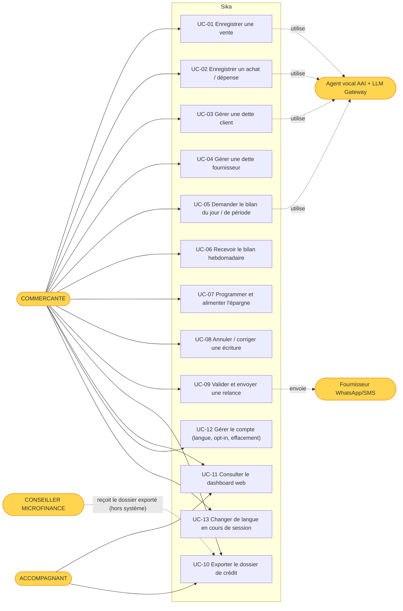
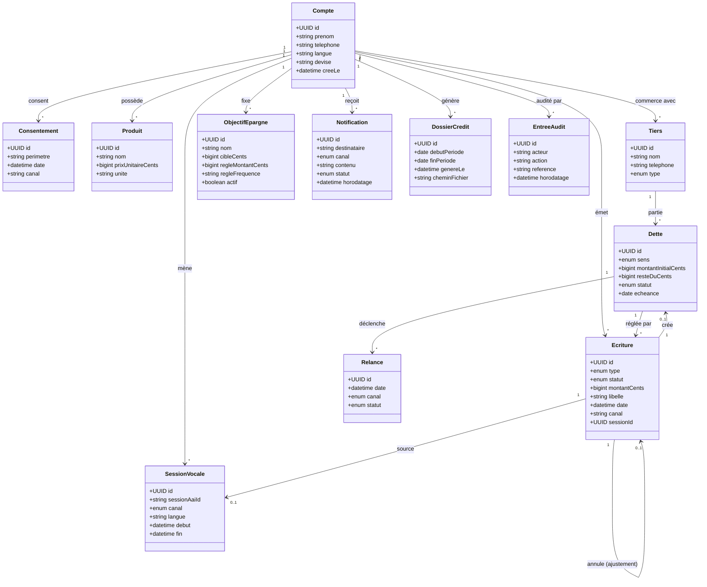
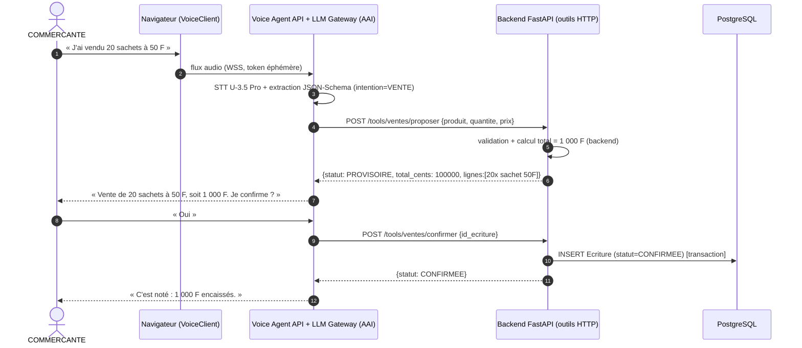
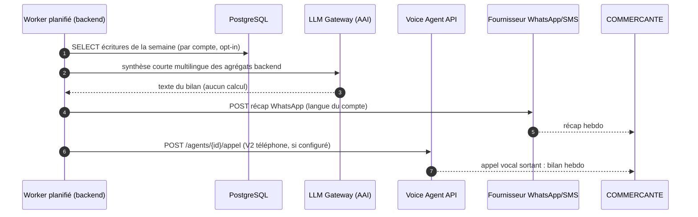
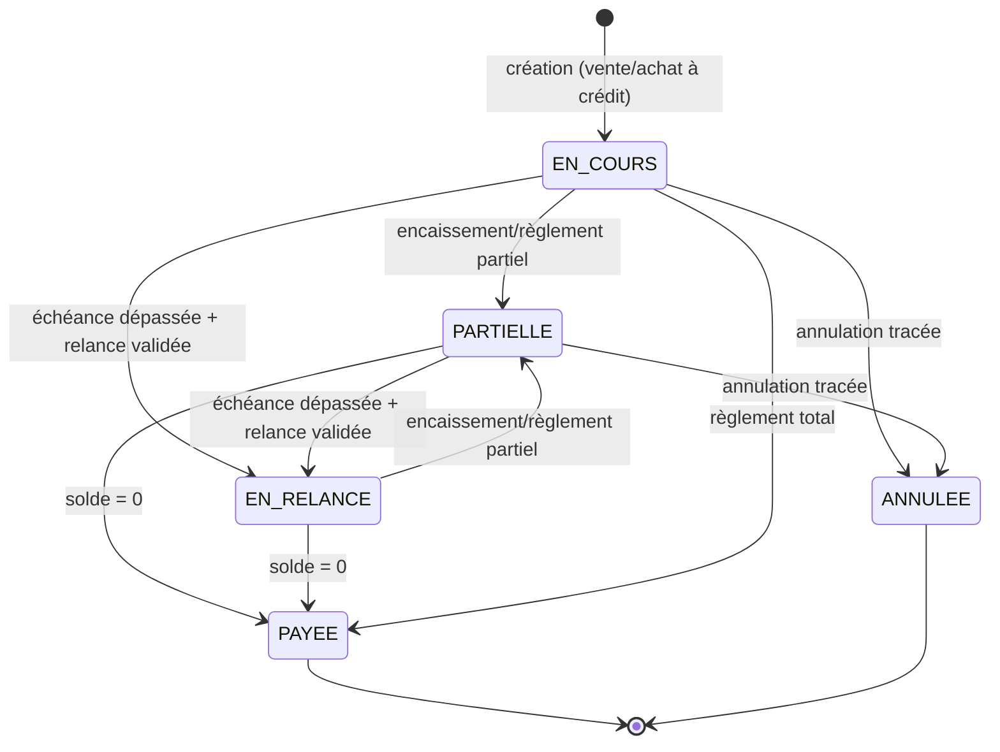
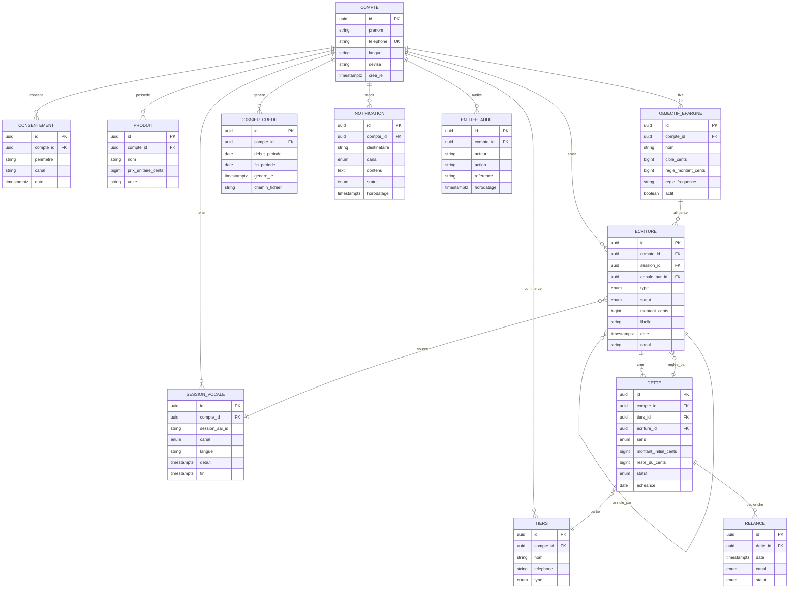

# SIKA — CAHIER DES CHARGES LOGICIEL
## Software Requirements Specification (SRS) — conforme ISO/IEC/IEEE 29148:2018

| Champ | Valeur |
|---|---|
| **Projet** | Sika (anciennement « Sika ») — assistant vocal multilingue de tenue de caisse pour micro-entrepreneurs du secteur informel |
| **Version du document** | 1.0 |
| **Date** | 06/09/2026 |
| **Statut** | Brouillon — en revue |
| **Auteur** | Jovanny K. (avec assistance Hermes) |
| **Organisation** | Projet personnel — soumission « AssemblyAI Voice Agent Hackathon » (LabLab.ai, 1er–30 sept. 2026) |
| **Norme de référence** | ISO/IEC/IEEE 29148:2018 — Systems and software engineering — Life cycle processes — Requirements engineering |
| **Méthodologie UML** | UML 2.5.1 (OMG 2017), diagrammes rendus en Mermaid |
| **Documents liés** | Page du hackathon (LabLab.ai) ; docs AssemblyAI Voice Agent API / Universal-3.5 Pro Streaming / LLM Gateway ; profil ILO informel Afrique ; factsheet IFC MSME ; rapport AFI MSME Access to Finance ; page crédits FUCEC-TOGO |

---

## TABLE DES MATIÈRES

1. Partie I — Introduction
   - 1.1 But du document · 1.2 Portée du produit · 1.3 Définitions, acronymes · 1.4 Références · 1.5 Vue d'ensemble · 1.6 Analyse de risques
2. Partie II — Description globale
   - 2.1 Perspective produit · 2.2 Fonctions principales · 2.3 Classes d'utilisateurs · 2.4 Contraintes d'environnement · 2.5 Contraintes de conception · 2.6 Hypothèses et dépendances · 2.7 Phasage V1/V2/V3
3. Partie III — Exigences spécifiques
   - 3.1 Interfaces externes · 3.2 Exigences fonctionnelles par module · 3.3 Performance · 3.4 Base de données logique · 3.5 Attributs du système (NF) · 3.6 IA / Éthique
4. Partie IV — Annexes
   - Annexe A — Diagrammes UML (Mermaid) · Annexe B — Cas d'utilisation détaillés (Fully-Dressed) · Annexe C — Modèle de données · Annexe D — Matrice de traçabilité (RTM) · Annexe E — Glossaire · Annexe F — Index des exigences

---

# PARTIE I — INTRODUCTION

## 1.1 But du document

Ce document spécifie les exigences du produit logiciel **« Sika »** : un assistant vocal qui tient le livre de caisse des micro-entrepreneurs du secteur informel — ventes, achats, dettes, épargne et bilans — **entièrement à l'oral**, dans la langue de travail de l'utilisateur, sans exiger de savoir lire ou écrire.

Le document s'adresse à :
- L'équipe de développement (unique développeur, Jovanny K.) : référence non ambiguë pour l'implémentation du MVP ;
- Le product owner : validation de la portée et des priorités ;
- L'équipe QA : base des tests d'acceptation ;
- Le jury du hackathon LabLab / AssemblyAI : preuve de rigueur d'ingénierie des besoins ;
- Les parties prenantes métier (institutions de microfinance, ONG) : compréhension de la valeur du produit.

**Contexte de recherche (source du besoin)** : 86,3 % de l'emploi en Afrique subsaharienne est informel (ILO, 2024) ; 87,9 % au Togo (INSEED) ; 51 % des MSME formelles d'Afrique subsaharienne n'accèdent pas (ou partiellement) au crédit, et l'accès est « typiquement sévèrement restreint » pour l'informel (IFC/AFI). Les institutions de microfinance exigent de « justifier de revenus stables » et de « démontrer sa capacité de remboursement » (conditions publiées FUCEC-TOGO) — preuves que le secteur informel ne peut pas produire faute d'enregistrement. **Sika crée cet enregistrement par la voix.**

## 1.2 Portée du produit

### 1.2.1 Dans le périmètre (V1 — MVP hackathon, livrable avant le 27/09/2026)

- Enregistrement vocal d'**opérations commerciales** : ventes (comptant et à crédit), achats/dépenses, encaissements, règlements de dettes, écritures d'épargne ;
- **Confirmation orale systématique** de chaque écriture avant persistance (garde-fou anti-erreur) ;
- Suivi des **dettes** clients et fournisseurs avec échéances et relances proposées ;
- **Bilans** parlés (jour, période personnalisée) et **rapport hebdomadaire vocal programmé** ;
- **Épargne programmée** (règle périodique simple) ;
- **Dossier de crédit exportable** (« historique bancable » : activité datée, cash-flow, régularité, épargne) destiné aux institutions de microfinance ;
- Récapitulatifs écrits par **WhatsApp / SMS** (opt-in) ;
- **Multilinguisme FR / EN / PT / ES** (entrée et sortie vocales natives, code-switching entre ces langues) ;
- **Dashboard web** de consultation (lecture, correction, export) pour l'utilisateur qui sait lire ou son accompagnant ;
- Canal vocal **navigateur** (Voice Agent API) ; canal **téléphonique** (Twilio/SIP) en V1 si le budget crédits le permet, sinon V2 ;
- Locale : **franc CFA (XOF)** en V1 ; montants gérés en centimes.

### 1.2.2 Hors périmètre (toutes versions)

- Aucun conseil financier, fiscal, juridique ou d'investissement délivré par l'agent ;
- Aucune exécution automatique de transactions financières (paiement Mobile Money, virement) ;
- Aucune décision de crédit : le dossier est produit, la décision appartient à l'institution ;
- Aucune tenue de comptabilité en partie double ni production d'états financiers certifiés (OHADA) ;
- Aucune gestion de stock avancée (lots, périssabilité, inventaire multi-dépôts) ;
- Aucune langue vernaculaire non supportée par la plateforme vocale (éwé, kabyè, moba ou autres langues locales) en V1 — voir HYP-001 ;
- Aucune application mobile native (web responsive uniquement) ;
- Aucune marketplace, ni paiement intégré, ni fonction sociale.

### 1.2.3 Phasage

| Version | Périmètre | Cible |
|---|---|---|
| V1 (MVP hackathon) | §1.2.1 complet, canal navigateur + option téléphone, FR/EN/PT/ES, dashboard, dossier de crédit | 27/09/2026 (soumission 30/09) |
| V2 | Canal téléphonique Twilio généralisé, multi-devises, gestion de stock simple, module « vente de récolte » (agro), statistiques avancées | Post-hackathon |
| V3 | Partenariats microfinance (export direct, scoring partagé), onboarding communautaire, langues additionnelles selon disponibilité plateforme | Long terme |

## 1.3 Définitions, acronymes, abréviations

*(Glossaire complet : Annexe E)*

| Terme / Acronyme | Définition |
|---|---|
| SRS | Software Requirements Specification |
| UC | Cas d'utilisation (Use Case) |
| REQ | Exigence (requirement) |
| RTM | Requirements Traceability Matrix (matrice de traçabilité) |
| RF | RFC 2119 — mots-clés « doit / doit pas » |
| AAI | AssemblyAI (fournisseur de la plateforme vocale) |
| Voice Agent API | API AssemblyAI d'agents vocaux de bout en bout |
| LLM Gateway | Passerelle AssemblyAI unifiée (25+ modèles, OpenAI-compatible) |
| STT / TTS | Speech-to-Text / Text-to-Speech |
| U-3.5 Pro | Universal-3.5 Pro Streaming, modèle STT temps réel AAI (18 langues) |
| Écriture | Enregistrement comptable simple d'une opération (vente, dépense, encaissement, règlement, épargne, ajustement) |
| Caisse | Trésorerie physique et logique du micro-entrepreneur suivie par le produit |
| Tiers | Personne ou entité avec laquelle l'utilisateur commerce (client ou fournisseur) |
| Relance | Message de rappel de dette échue, proposé par le système puis envoyé sur confirmation |
| Dossier de crédit | Export structuré de l'activité financière d'un utilisateur sur une période, destiné à une institution de microfinance |
| COOPEC / SFD | Coopérative d'épargne et de crédit / Système financier décentralisé (Togo, UEMOA) |
| Mobile Money | Paiement mobile (MTN MoMo, Flooz, T-Money, Wave…) |
| FCFA / XOF | Franc CFA (Union économique et monétaire ouest-africaine) |
| RGPD | Règlement général sur la protection des données (UE 2016/679) |
| Loi 2019-014 | Loi togolaise sur la protection des données à caractère personnel |

## 1.4 Références

| # | Référence | Date | Usage |
|---|---|---|---|
| R1 | ISO/IEC/IEEE 29148:2018 — Requirements engineering | 2018 | Norme structurante du SRS |
| R2 | UML 2.5.1 (OMG) | 2017 | Notation des diagrammes |
| R3 | RFC 2119 (mots-clés exigentiels) | 1997 | Sémantique des exigences |
| R4 | Docs AssemblyAI — Voice Agent API (voice-agent-api) | 2026 | Interface vocale, agents, tools, sessions |
| R5 | Docs AssemblyAI — Universal-3.5 Pro Streaming & « Supported languages » (Voice Agent API) | 2026 | Modèle STT, liste des 18 langues d'entrée / 6 de sortie |
| R6 | Docs AssemblyAI — LLM Gateway (quickstart, structured outputs, json-repair) | 2026 | Cerveau LLM, sorties structurées |
| R7 | Page officielle « AssemblyAI Voice Agent Hackathon », LabLab.ai | 2026 | Contraintes de soumission, prix, critères |
| R8 | ILO — Overview of the informal economy in Africa (profil statistique régional) | 2025 | Statistiques informel Afrique / ASS (86,3 %) |
| R9 | INSEED / République Togolaise — « 87,9 % des emplois au Togo sont dans l'informel » | 2018-2023 | Statistique Togo |
| R10 | IFC — MSME Finance factsheet (Financial Institutions Group) | 2025 | Gap financement 5,7/8 T$, 70 % MSME |
| R11 | AFI — Scoping & Assessment Report : MSME Access to Finance Ecosystem in Africa | 2020 | 51 % MSME ASS, obstacles banques (EIB) |
| R12 | FUCEC-TOGO — page « Crédits » (conditions générales d'octroi) | 2026 | Exigences documentaires microfinance (Togo) |
| R13 | OWASP Top 10 | 2021 | Exigences de sécurité |
| R14 | RGPD (UE 2016/679) + Loi togolaise 2019-014 | 2016/2019 | Protection des données (voix = données personnelles) |

## 1.5 Vue d'ensemble du document

La **Partie I** (présente) cadre le projet : but, périmètre, références, risques. La **Partie II** décrit le produit globalement : positionnement, fonctions, utilisateurs, contraintes, hypothèses, phasage. La **Partie III** contient toutes les exigences numérotées (interfaces, fonctionnelles par module, performance, base de données, attributs non fonctionnels, IA/éthique). La **Partie IV** regroupe les annexes : diagrammes UML en Mermaid, cas d'utilisation détaillés au format Fully-Dressed, modèle de données, matrice de traçabilité (RTM), glossaire et index des exigences.

## 1.6 Analyse de risques (résumé)

| ID | Risque | Probabilité | Impact | Mitigation |
|---|---|---|---|---|
| RSK-001 | **Reconnaissance vocale erronée d'un montant** → écriture fausse en base | M | H | Confirmation orale systématique avant persistance ; correction vocale (« annule la dernière ») ; l'utilisateur reste seul maître de la validation |
| RSK-002 | **Attente produit déçue sur les langues locales** (éwé, kabyè, moba non supportés par la plateforme) | H | M | Positionnement honnête FR/EN/PT/ES ; architecture en « packs de langue » ; cible francophone/anglophone/lusophone/hispanophone du commerce |
| RSK-003 | **Dérive des coûts API** (sessions longues, usage réel) au-delà des crédits gratuits | M | M | Budget par session ; fermeture propre des sessions (billing par durée) ; plafond d'usage par compte ; suivi des métriques |
| RSK-004 | **Données vocales sensibles** (conversations commerciales, PII) | M | H | Chiffrement en transit ; conservation minimale ; consentement ; suppression à la demande (RGPD/Loi 2019-014) ; politique documentée (REQ-NF-SEC) |
| RSK-005 | **Hallucination LLM** (totaux inventés, conseils hors périmètre) | M | H | Tous les calculs faits par le backend (jamais par le LLM) ; outils HTTP = seule source des données ; prompt restrictif ; tests d'IA (TAI) |
| RSK-006 | **Adoption nulle** si la confirmation orale est trop lente ou verbeuse | M | M | Prompt « réponses courtes » ; confirmation en une phrase ; mesures de latence (REQ-PERF) ; tests utilisateurs |
| RSK-007 | **Fraude / usurpation** sur le dashboard web (modification d'écritures) | L | H | Authentification (code PIN/OTP), journal d'audit complet, aucune suppression physique |
| RSK-008 | **Indisponibilité plateforme AAI** pendant une démo | L | H | Plan B de démo (enregistrement vidéo de session réelle) ; message d'erreur clair et reprise |

# PARTIE II — DESCRIPTION GLOBALE

## 2.1 Perspective produit

**Sika** est un nouveau produit, sans existant interne. Il appartient à la catégorie « gestion financière des très petites entreprises », mais inverse le paradigme des outils existants : ceux-ci (applications de comptabilité, tableurs, applications de paiement) exigent **lecture, écriture et saisie** ; Sika exige seulement **la parole**, sur un canal qui fonctionne sur n'importe quel téléphone.

**Positionnement** (issu de la recherche R8-R12) : le micro-entrepreneur informel ne peut pas « justifier de revenus stables » ni « démontrer sa capacité de remboursement » (conditions FUCEC-TOGO) parce qu'il n'enregistre rien. Sika ne remplace ni la garantie ni l'épargne préalable exigées par les institutions ; il fournit **la moitié du dossier qui n'existe jamais** : un historique d'activité daté, vérifiable et exportable. Le produit rend l'utilisateur **éligible et crédible**, il ne décide pas de l'octroi.

**Différenciateurs** :
1. *Voice-first* : 100 % des saisies se font à l'oral (aucun clavier requis) ;
2. *Confirmation systématique* : aucune écriture n'est persistée sans relecture orale par l'utilisateur ;
3. *Multilingue véhiculaire africain* : FR / EN / PT / ES, avec code-switching natif entre ces langues (contrairement aux solutions monolingues locales) ;
4. *Donnée bancable* : le dossier de crédit exportable, conçu pour les conditions réelles des SFD (R12) ;
5. *Stack 100 % API managée* : zéro serveur média, zéro modèle à héberger (Voice Agent API + LLM Gateway AAI), déploiement Render gratuit.

## 2.2 Fonctions principales

- **F-01** — Conversation vocale multilingue (FR/EN/PT/ES) avec un agent de caisse (accueil, intents métier, aide) ;
- **F-02** — Enregistrement vocal des ventes au comptant (une ou plusieurs lignes) avec calcul backend et confirmation orale ;
- **F-03** — Enregistrement vocal des achats/dépenses ;
- **F-04** — Gestion des dettes : création (client/fournisseur), échéances, encaissements, règlements, statuts, relances proposées ;
- **F-05** — Épargne programmée : objectif, règle périodique, écritures d'épargne, consultation ;
- **F-06** — Bilans parlés (jour / période) et rapport hebdomadaire vocal programmé ;
- **F-07** — Dossier de crédit exportable (activité, cash-flow, régularité, épargne) ;
- **F-08** — Notifications écrites WhatsApp/SMS (récap, relances) sur opt-in ;
- **F-09** — Dashboard web de consultation et de correction (réservé à l'utilisateur ou son accompagnant) ;
- **F-10** — Gestion du compte : langue, téléphone, devise, suppression des données (RGPD).

## 2.3 Classes d'utilisateurs

| Rôle | Description | Compétences | Fréquence | Fonctions accessibles |
|---|---|---|---|---|
| **COMMERCANTE** (acteur primaire) | Micro-entrepreneuse du secteur informel (ex. vendeuse au marché) ; sait compter, lit/écrit peu ou pas ; parle FR ou EN/PT/ES | Orale (aucune compétence technique requise) | Plusieurs fois par jour | F-01 à F-08 (canal vocal) ; F-09 si elle sait lire ou avec aide |
| **ACCOMPAGNANT** (famille, aide) | Proche qui lit/écrit ; assiste pour la consultation web, les corrections, l'export | Lecture/écriture basique | Hebdomadaire | F-09, F-07 (dashboard, export) |
| **CONSEILLER MICROFINANCE** (externe, hors système) | Agent SFD qui reçoit le dossier de crédit exporté | Professionnel | À la demande | Lecture du dossier (hors authentification, format ouvert) |
| **DÉVELOPPEUR / ADMIN** | Unique développeur (Jovanny K.) ; administration technique | Avancé | Quotidienne pendant le développement | Toutes, + supervision sessions, métriques, configuration agent |

**Acteurs systèmes externes** : AssemblyAI Voice Agent API (voix), AssemblyAI LLM Gateway (LLM), Fournisseur WhatsApp/SMS, Twilio (V2 — téléphone), Render (hébergement), PostgreSQL (données), éventuel service d'envoi d'e-mail.

## 2.4 Contraintes d'environnement opérationnel

| Contrainte | Détail |
|---|---|
| Canal vocal V1 | Navigateur (Chrome / Edge, microphone) via Voice Agent API — aucun plugin |
| Canal vocal V2 | Réseau téléphonique (Twilio/SIP) — fonctionne sur tout téléphone, sans data |
| Cerveau conversationnel | LLM Gateway AAI (modèle multilingue à configurer, ex. famille Claude/GPT/Qwen selon disponibilité) |
| Reconnaissance vocale | Universal-3.5 Pro Streaming (AAI) — 18 langues d'entrée dont FR, EN, PT, ES, AR |
| Synthèse vocale | Voix natives AAI — FR (`estelle`), EN, ES, PT (6 langues de sortie officielles) |
| Backend | FastAPI (Python 3.11+), uv, WebSockets, exécuté sur Render (free tier) |
| Base de données | PostgreSQL 15+ (Render free tier), accès via SQLAlchemy/Alembic |
| Frontend | React + Vite (dashboard), responsive mobile |
| Envoi WhatsApp/SMS | API d'un fournisseur agrégateur (Twilio ou équivalent gratuit/first) |
| Fuseaux | Stockage UTC ; affichage heure locale (Afrique/Lomé par défaut) |
| Navigateurs dashboard | Chrome, Edge, Firefox, Safari (2 dernières versions majeures) |

## 2.5 Contraintes de conception et d'implémentation

| ID | Contrainte | Justification |
|---|---|---|
| C-CON-001 | Tous les montants sont stockés en **centimes** (BIGINT) ; la virgule n'existe qu'à l'affichage | Précision monétaire, évite les erreurs de flottant |
| C-CON-002 | Devise unique en V1 : **XOF** ; devise rattachée au compte | Simplicité du MVP, marché cible UEMOA |
| C-CON-003 | **Le backend calcule tous les totaux et soldes** ; le LLM ne reçoit que des données déjà calculées et ne produit jamais de chiffre | Anti-hallucination structurel (RSK-005) |
| C-CON-004 | Toute écriture passe par un **état PROVISOIRE → CONFIRMÉE** après validation orale ou web ; aucune écriture définitive directe | Garde-fou anti-erreur (RSK-001) |
| C-CON-005 | **Aucune suppression physique** d'écriture : annulation = écriture d'ajustement + statut ANNULEE | Auditabilité financière, traçabilité |
| C-CON-006 | Isolation **multi-tenant** stricte : toute requête de données porte le filtre tenant (row-level) | Un commerçant ne voit jamais les données d'un autre |
| C-CON-007 | Le système s'appuie sur la **Voice Agent API** pour la conversation et sur des **outils HTTP** pour toute lecture/écriture de données métier | Séparation canal vocal / logique métier ; secrets hors du client |
| C-CON-008 | Les réponses vocales de l'agent sont **courtes** (≤ 2 phrases par défaut, sauf bilan demandé) | Latence perçue et charge cognitive de l'utilisateur oral |
| C-CON-009 | Langues V1 : FR, EN, PT, ES — alignées sur les langues d'entrée **et** de sortie natives AAI | R5 : l'arabe est en entrée mais pas encore en sortie vocale → exclu du V1 |
| C-CON-010 | Conformité RGPD + Loi 2019-014 (Togo) : consentement, minimisation, droit à l'effacement | La voix et les conversations sont des données personnelles |
| C-CON-011 | Déploiement sur **infrastructure gratuite** (Render free, Postgres free, crédits AAI du hackathon) | Contrainte du projet (zéro budget) |
| C-CON-012 | Interface des outils HTTP décrite en OpenAPI ; contrats JSON stricts | Réutilisabilité (dashboard, webhooks, futur partenaire) |
| C-CON-013 | Chaque session vocale AAI est identifiée et **rattachée au compte** utilisateur via une liaison (token éphémère ou en-tête) | Traçabilité des écritures vers la conversation source (audit) |
| C-CON-014 | Les numéraux et unités usuelles (FCFA, « mille », « sachet », « tas »…) sont ajoutés au **vocabulaire de reconnaissance** (keyterms) | Fiabilité de la transcription des montants |

## 2.6 Hypothèses et dépendances

| ID | Hypothèse | Risque si fausse |
|---|---|---|
| HYP-001 | La plateforme vocale (Voice Agent API) ne supporte pas les langues vernaculaires togolaises (éwé, kabyè, moba) en V1 ; le produit cible les locuteurs des langues véhiculaires FR/EN/PT/ES | Vérifié sur docs AAI (R5) : 18 langues, aucune langue africaine vernaculaire — l'hypothèse est **confirmée** ; le ciblage FR/EN/PT/ES reste valide pour le commerce |
| HYP-002 | Une part significative des micro-entrepreneurs des marchés urbains togolais conduit ses affaires en français (ou EN/PT/ES selon pays) | Si fausse : adoption limitée au segment francophone lettré — mitigé par C-CON-009 et packs de langue futurs |
| HYP-003 | L'utilisateur cible a accès à un téléphone (même basique) et, en V1 web, à un point d'accès internet | Si fausse : restreindre la V1 aux démonstrations / accompagnées |
| HYP-004 | Les crédits gratuits AAI + niveaux gratuits Render/Postgres suffisent à la démonstration et aux tests du MVP | Si fausse : réduire le volume de sessions de test (RSK-003) |
| HYP-005 | L'utilisateur accepte la confirmation orale systématique (coût : quelques secondes par opération) | Si fausse : concevoir un mode « confiance » paramétrable (V2) |
| HYP-006 | Un numéro de téléphone peut servir d'identifiant de compte (pratique Mobile Money) | Si fausse : basculer sur identifiant + OTP e-mail |
| HYP-007 | Les institutions de microfinance considèrent un historique d'activité exporté comme un élément de dossier recevable (en complément de garantie et épargne) | Si fausse : l'argument « dossier bancable » perd de sa force — contacter une SFD en V2 pour co-construire le format |

**Dépendances externes critiques** : AssemblyAI Voice Agent API et LLM Gateway (disponibilité, tarifs, crédits) · Fournisseur WhatsApp/SMS · Render (web service + PostgreSQL) · (V2) Twilio.

## 2.7 Répartition des exigences (V1 / V2 / V3)

- **V1 (MVP)** : modules AGT, VEN, ACH, DET, EPG, BIL, CRD, NOT, CMP, DSH — canal navigateur (+ téléphone si budget), FR/EN/PT/ES, XOF. Toutes les exigences marquées V1 dans la Partie III.
- **V2** : canal téléphonique généralisé (REQ-IF-C-003, REQ-IF-S-006), multi-devises, stock simple, module agro « vente de récolte », correction vocale avancée, intégration SFD pilote.
- **V3** : export direct vers institutions partenaires, scoring partagé sur consentement, langues additionnelles selon l'évolution de la plateforme, fonctionnalités communautaires (tontines).

# PARTIE III — EXIGENCES SPÉCIFIQUES

> **Conventions** : colonne « S » = Source (U = utilisateur/PO, R = réglementaire, T = technique, M = métier/parties prenantes). « Prio » = Priorité (H/M/L). « V » = Version cible (V1 = MVP, V2, V3). « Vérif » = méthode de vérification (Test, Démo, Inspection, Analyse, Audit). Mots-clés « doit »/« doit pas » au sens RFC 2119 (R3). Toutes les exigences de ce document sont au statut « Proposé » tant que le document n'est pas validé.

## 3.1 Exigences d'interfaces externes

### 3.1.1 Interfaces utilisateur (canaux homme-machine)

| ID | Exigence | S | Prio | V | Vérif |
|---|---|---|---|---|---|
| REQ-IF-U-001 | Le système doit fournir un canal vocal navigateur (WebSocket navigateur ↔ Voice Agent API) démarrant à la demande de l'utilisateur, sans installation de plugin. | U | H | V1 | Démo |
| REQ-IF-U-002 | Le système doit fournir un dashboard web responsive (React) présentant le solde du jour, le chiffre d'affaires de la période, la liste des écritures, les dettes en cours et l'épargne. | U | H | V1 | Démo |
| REQ-IF-U-003 | Le dashboard doit permettre de consulter le détail d'une écriture (montant, type, tiers, date, session vocale source) et de l'annuler (écriture d'ajustement). | U | H | V1 | Test |
| REQ-IF-U-004 | Le dashboard doit permettre de lancer l'export du dossier de crédit et de télécharger le fichier produit. | U | H | V1 | Test |
| REQ-IF-U-005 | Le parcours d'onboarding web doit collecter : prénom, langue d'usage (FR/EN/PT/ES), téléphone, devise ; il doit proposer un essai vocal immédiat. | U | H | V1 | Test |

### 3.1.2 Interfaces logicielles (APIs tierces)

| ID | Exigence | S | Prio | V | Vérif |
|---|---|---|---|---|---|
| REQ-IF-S-001 | Le système doit s'intégrer à la **Voice Agent API AssemblyAI** : création/publipostage d'agent (prompt système, voix, greeting, outils HTTP, réglages de turn-taking), démarrage de session, réception d'événements WebSocket. | T | H | V1 | Test |
| REQ-IF-S-002 | Le système doit exposer des **outils HTTP** (contrats OpenAPI) appelables par l'agent pour lire/écrire les données métier : comptes, écritures, dettes, épargne, bilans, dossiers. | T | H | V1 | Test |
| REQ-IF-S-003 | Le système doit utiliser le **LLM Gateway AssemblyAI** (endpoint OpenAI-compatible) comme cerveau conversationnel avec sorties structurées JSON-Schema pour l'extraction des opérations. | T | H | V1 | Test |
| REQ-IF-S-004 | Le système doit s'intégrer à un fournisseur d'envoi **WhatsApp/SMS** pour les récapitulatifs et relances (opt-in). | U | M | V1 | Test |
| REQ-IF-S-005 | Le système doit consommer les **webhooks de cycle de vie de session** AAI (fin de session, erreur) pour clôturer proprement le contexte applicatif. | T | M | V1 | Test |
| REQ-IF-S-006 | (V2) Le système doit s'intégrer à **Twilio (SIP)** pour joindre l'agent depuis le réseau téléphonique. | U | M | V2 | Démo |
| REQ-IF-S-007 | Le système doit récupérer les **artefacts de session AAI** (timeline, métadonnées) pour alimenter le journal d'audit et la supervision. | T | M | V1 | Test |

### 3.1.3 Interfaces de communication

| ID | Exigence | S | Prio | V | Vérif |
|---|---|---|---|---|---|
| REQ-IF-C-001 | Le flux audio navigateur ↔ AAI doit transiter en **WebSocket sécurisé (WSS)** ; le navigateur ne doit jamais détenir la clé API AAI (token éphémère émis par le backend). | R/T | H | V1 | Audit |
| REQ-IF-C-002 | Les appels backend entre le service Render et AAI/LLM Gateway doivent être authentifiés par clé API (en-tête Authorization), transmise uniquement côté serveur. | R/T | H | V1 | Audit |
| REQ-IF-C-003 | (V2) La terminaison téléphonique SIP (Twilio) doit être configurée sans serveur média hébergé (trunk vers AAI). | T | M | V2 | Démo |
| REQ-IF-C-004 | Toutes les communications sortantes (WhatsApp/SMS) doivent être enregistrées (statut d'envoi, horodatage) en base. | T | M | V1 | Test |

### 3.1.4 Interfaces de données

| ID | Exigence | S | Prio | V | Vérif |
|---|---|---|---|---|---|
| REQ-IF-D-001 | Tous les montants échangés entre composants doivent être des entiers **en centimes** (XOF) ; aucun format décimal ne doit transiter dans les contrats JSON métier. | T | H | V1 | Inspection |
| REQ-IF-D-002 | Les dates échangées doivent être en **ISO 8601 UTC** ; l'affichage vocal et web doit convertir en heure locale (défaut Afrique/Lomé) et au format JJ/MM/AAAA. | T | H | V1 | Inspection |
| REQ-IF-D-003 | Le système doit attribuer un identifiant unique (UUID) à chaque compte, écriture, dette, relance et session, stable entre le backend et les artefacts AAI. | T | H | V1 | Inspection |

## 3.2 Exigences fonctionnelles

### 3.2.1 Module AGT — Agent vocal conversationnel

| ID | Exigence | S | Prio | V | Vérif |
|---|---|---|---|---|---|
| REQ-F-AGT-001 | L'agent doit accueillir l'utilisateur dans la langue enregistrée sur son compte (FR/EN/PT/ES) et se présenter comme le « livre de caisse » du commerce. | U | H | V1 | Démo |
| REQ-F-AGT-002 | L'agent doit reconnaître au minimum les intentions : vente, achat/dépense, dette, paiement reçu, règlement fournisseur, bilan, épargne, relance, annulation, aide, clôture. | U | H | V1 | Test |
| REQ-F-AGT-003 | L'agent doit poser des questions ciblées lorsque l'information est incomplète (montant, produit, tiers, comptant ou à crédit) et ne doit jamais inventer une valeur manquante. | U | H | V1 | Test (TAI) |
| REQ-F-AGT-004 | L'agent doit **relire oralement** chaque opération avant validation (« Bien reçu : vente de 20 sachets à 50 F, soit 1 000 F. Au comptant. Je confirme ? ») et ne persister l'écriture qu'après confirmation explicite. | U | H | V1 | Test |
| REQ-F-AGT-005 | L'agent doit accepter l'**interruption** de l'utilisateur en cours de réponse (barge-in) et s'arrêter de parler immédiatement. | U | H | V1 | Test |
| REQ-F-AGT-006 | L'agent doit maintenir des réponses courtes (deux phrases maximum hors bilans et confirmations) et un débit naturel. | U | M | V1 | Test (TU) |
| REQ-F-AGT-007 | L'agent doit gérer le **code-switching natif** entre les langues supportées (ex. phrase FR avec incises EN) sans perte de compréhension de l'intention. | U | M | V1 | Test (TAI) |
| REQ-F-AGT-008 | L'agent doit permettre à l'utilisateur de **changer de langue en cours de session** (« parle en anglais ») et répondre dans la nouvelle langue jusqu'à nouvel ordre. | U | M | V1 | Test |
| REQ-F-AGT-009 | L'agent doit permettre d'**annuler la dernière opération confirmée** (« annule la dernière ») en créant une écriture d'ajustement inverse, après nouvelle confirmation. | U | H | V1 | Test |
| REQ-F-AGT-010 | Lorsqu'une intention est ambiguë ou hors périmètre, l'agent doit le dire explicitement, reformuler ce qu'il a compris et proposer les actions disponibles ; il doit refuser poliment toute demande de conseil financier ou d'investissement. | R/M | H | V1 | Test (TAI) |
| REQ-F-AGT-011 | L'agent doit utiliser un vocabulaire de reconnaissance (keyterms) couvrant les produits usuels, unités (sachet, tas, kilo, carton), numéraux et « FCFA », configurable par compte. | T | M | V1 | Test |
| REQ-F-AGT-012 | En cas d'échec de session (erreur AAI, réseau), l'agent doit informer l'utilisateur et proposer une reprise sans perte des données déjà confirmées. | U | M | V1 | Test |

### 3.2.2 Module VEN — Ventes et encaissements

| ID | Exigence | S | Prio | V | Vérif |
|---|---|---|---|---|---|
| REQ-F-VEN-001 | Le système doit enregistrer une **vente au comptant** (produit, quantité, prix unitaire, montant) après confirmation orale, en une écriture de type VENTE à l'état CONFIRMÉE. | U | H | V1 | Test |
| REQ-F-VEN-002 | Le système doit accepter une vente en **plusieurs lignes** dans une même session (« 2 kilos de tomates à 500 F et 3 sachets à 100 F ») et n'en faire qu'une écriture consolidée dont le total est calculé par le backend. | U | M | V1 | Test |
| REQ-F-VEN-003 | Le système doit calculer le montant total **côté backend** à partir des lignes reconnues et l'utiliser pour la confirmation orale ; le LLM ne doit fournir aucun total. | T | H | V1 | Test |
| REQ-F-VEN-004 | Lorsque le produit cité est inconnu du compte, le système doit demander le nom et le prix unitaire usuel, créer une fiche produit simple, puis poursuivre l'enregistrement. | U | M | V1 | Test |
| REQ-F-VEN-005 | Le système doit enregistrer une **vente à crédit** en créant simultanément l'écriture de vente et une dette client (montant, tiers, échéance éventuelle). | U | H | V1 | Test |
| REQ-F-VEN-006 | Le système doit permettre l'**annulation** d'une vente (écriture d'ajustement inverse, statuts ANNULEE) avec traçabilité complète. | U | H | V1 | Test |
| REQ-F-VEN-007 | Le système doit horodater chaque vente (UTC) et conserver le canal (vocal navigateur, téléphone, web) et la session source. | T | H | V1 | Test |
| REQ-F-VEN-008 | Le système doit rejeter toute vente de montant nul ou négatif et toute quantité non strictement positive. | T | H | V1 | Test |

### 3.2.3 Module ACH — Achats et dépenses

| ID | Exigence | S | Prio | V | Vérif |
|---|---|---|---|---|---|
| REQ-F-ACH-001 | Le système doit enregistrer une **dépense/achat** (libellé, montant, catégorie optionnelle) après confirmation orale, en écriture de type DEPENSE. | U | H | V1 | Test |
| REQ-F-ACH-002 | Le système doit enregistrer un **achat à crédit** (ex. marchandise chez un grossiste) en créant simultanément une dette fournisseur avec son échéance. | U | H | V1 | Test |
| REQ-F-ACH-003 | Le système doit permettre de préciser la catégorie de dépense (réassort, transport, électricité, autre) par la voix, avec catégorie « autre » par défaut. | U | L | V1 | Test |
| REQ-F-ACH-004 | Le système doit associer une dépense à un **paiement Mobile Money** si l'utilisateur le précise, sans jamais initier le paiement lui-même (déclaration seule). | M | M | V1 | Test |
| REQ-F-ACH-005 | Le système doit permettre l'annulation d'une dépense (ajustement inverse) après confirmation. | U | M | V1 | Test |
| REQ-F-ACH-006 | Le système doit rejeter toute dépense de montant nul, négatif ou supérieur à 100 000 000 FCFA (contrôle de plausibilité). | T | M | V1 | Test |

### 3.2.4 Module DET — Dettes et relances

| ID | Exigence | S | Prio | V | Vérif |
|---|---|---|---|---|---|
| REQ-F-DET-001 | Le système doit créer une **dette client** (tiers, montant, échéance optionnelle) à partir d'une vente à crédit ou d'une déclaration vocale dédiée. | U | H | V1 | Test |
| REQ-F-DET-002 | Le système doit créer une **dette fournisseur** (tiers, montant, échéance) à partir d'un achat à crédit ou d'une déclaration vocale dédiée. | U | H | V1 | Test |
| REQ-F-DET-003 | Le système doit maintenir pour chaque dette le montant initial, le **reste dû** (recalculé backend à chaque encaissement/règlement) et le statut (EN_COURS, PARTIELLE, PAYEE, ANNULEE, EN_RELANCE). | T | H | V1 | Test |
| REQ-F-DET-004 | Le système doit enregistrer un **encaissement partiel ou total** sur une dette client (paiement reçu) et un **règlement partiel ou total** sur une dette fournisseur, avec écritures correspondantes. | U | H | V1 | Test |
| REQ-F-DET-005 | Le système doit répondre à la demande vocale « qui me doit ? » / « à qui je dois ? » en listant les dettes en cours, triées par ancienneté, avec montants restants et échéances. | U | H | V1 | Test |
| REQ-F-DET-006 | Le système doit **proposer** une relance (message écrit prédéfini) pour toute dette client échue depuis plus de 3 jours, lors de la prochaine interaction ou selon planification ; l'envoi doit requérir la confirmation de l'utilisateur. | U | M | V1 | Test |
| REQ-F-DET-007 | La relance doit inclure le tiers, le montant restant dû et une formule courtoise paramétrable ; elle doit exclure tout contenu menaçant ou insultant. | R/M | H | V1 | Inspection |
| REQ-F-DET-008 | Le système doit permettre d'annuler une dette (erreur de saisie, dette soldée d'un commun accord) par écriture d'ajustement tracée. | U | M | V1 | Test |
| REQ-F-DET-009 | Le système doit appliquer la règle de cohérence : une dette annulée ne peut plus faire l'objet de relance ni d'encaissement. | T | H | V1 | Test |

### 3.2.5 Module EPG — Épargne programmée

| ID | Exigence | S | Prio | V | Vérif |
|---|---|---|---|---|---|
| REQ-F-EPG-001 | Le système doit permettre de créer un **objectif d'épargne** (nom, montant cible) par la voix (« je veux économiser 50 000 F pour le réassort »). | U | M | V1 | Test |
| REQ-F-EPG-002 | Le système doit permettre de définir une **règle périodique** (ex. « 1 000 F chaque soir ») rattachée à l'objectif. | U | M | V1 | Test |
| REQ-F-EPG-003 | Le système doit, à l'occasion de chaque session de clôture ou sur demande, **proposer** à l'utilisateur d'épargner selon sa règle (« Veux-tu mettre 1 000 F de côté ce soir ? ») ; l'écriture d'épargne n'est créée qu'après confirmation. | U | M | V1 | Test |
| REQ-F-EPG-004 | Le système doit répondre à la demande « combien j'ai épargné ? » avec le total épargné, la progression vers la cible et le solde de l'objectif. | U | M | V1 | Test |
| REQ-F-EPG-005 | Le système doit permettre de suspendre ou clôturer un objectif d'épargne sans perte de l'historique des écritures d'épargne. | U | L | V1 | Test |

### 3.2.6 Module BIL — Bilans et rapports

| ID | Exigence | S | Prio | V | Vérif |
|---|---|---|---|---|---|
| REQ-F-BIL-001 | Le système doit produire un **bilan du jour** vocal : total ventes, total dépenses, encaissements reçus, règlements effectués, épargne, solde de caisse calculé, et nombre de dettes en cours. | U | H | V1 | Test |
| REQ-F-BIL-002 | Le système doit produire un bilan pour une **période personnalisée** (jour, semaine, mois, ou dates dites par l'utilisateur). | U | M | V1 | Test |
| REQ-F-BIL-003 | Le système doit générer un **rapport hebdomadaire vocal programmé** (jour et heure configurables) résumant la semaine écoulée et les échéances à venir. | U | M | V1 | Test |
| REQ-F-BIL-004 | Le système doit lister, sur demande, les **produits les plus vendus** de la période (top 3) et le chiffre d'affaires associé. | U | L | V1 | Test |
| REQ-F-BIL-005 | Tous les agrégats du bilan doivent être **calculés par le backend** à partir des écritures CONFIRMÉES et PAYÉES, à l'exclusion des écritures ANNULEES et des écritures PROVISOIRES. | T | H | V1 | Test |
| REQ-F-BIL-006 | Lorsque aucune écriture n'existe sur la période, le système doit le dire explicitement et proposer d'enregistrer une première opération. | U | M | V1 | Test |
| REQ-F-BIL-007 | Le bilan doit être restituable également sur le dashboard web (chiffres identiques à la version vocale, même période). | U | M | V1 | Test |

### 3.2.7 Module CRD — Dossier de crédit (« historique bancable »)

| ID | Exigence | S | Prio | V | Vérif |
|---|---|---|---|---|---|
| REQ-F-CRD-001 | Le système doit générer un **dossier de crédit** pour une période glissante (3 ou 6 mois au choix) contenant : synthèse d'activité, total ventes/dépenses par mois, cash-flow mensuel, fréquence d'enregistrement (régularité), solde d'épargne, dettes actives et réglées. | U/M | H | V1 | Démo |
| REQ-F-CRD-002 | Le dossier doit présenter les montants en FCFA (format « 1 234 567 FCFA »), les dates au format JJ/MM/AAAA et être **lisible sans outil propriétaire** (Markdown/PDF/CSV). | U/M | H | V1 | Inspection |
| REQ-F-CRD-003 | Le dossier ne doit inclure **aucune donnée d'un autre compte** et doit exclure les écritures ANNULEES ; il doit mentionner sa date de génération et la période couverte. | R/T | H | V1 | Test |
| REQ-F-CRD-004 | Le système doit associer au dossier une **note de lecture** expliquant au conseiller (SFD) ce que chaque indicateur démontre (revenus, capacité de remboursement, régularité), sans jamais formuler d'avis d'octroi. | M | H | V1 | Inspection |
| REQ-F-CRD-005 | La génération du dossier doit être **horodatée et tracée** (qui, quand, canal vocal ou web). | R/T | H | V1 | Test |
| REQ-F-CRD-006 | L'accès à la génération du dossier doit être protégé (authentification web ou confirmation vocale par code personnel). | R | H | V1 | Test (TS) |

### 3.2.8 Module NOT — Notifications écrites (WhatsApp/SMS)

| ID | Exigence | S | Prio | V | Vérif |
|---|---|---|---|---|---|
| REQ-F-NOT-001 | Le système doit permettre à l'utilisateur d'**activer ou désactiver** les notifications WhatsApp/SMS (opt-in explicite, révocable à tout moment par la voix ou le web). | R | H | V1 | Test |
| REQ-F-NOT-002 | Le système doit envoyer un **récapitulatif de fin de journée** (total ventes, dépenses, dettes créées, épargne) si l'option est active et si au moins une écriture a été confirmée dans la journée. | U | M | V1 | Test |
| REQ-F-NOT-003 | Le système doit envoyer les **relances de dette** validées par l'utilisateur (REQ-F-DET-006) dans la langue du compte. | U | M | V1 | Test |
| REQ-F-NOT-004 | Chaque envoi doit produire un enregistrement de notification (destinataire, canal, contenu, statut, horodatage) consultable sur le dashboard. | T | M | V1 | Test |
| REQ-F-NOT-005 | En cas d'échec d'envoi, le système doit réessayer selon une politique configurée (2 tentatives) puis marquer l'envoi en échec sans perte du message. | T | M | V1 | Test |
| REQ-F-NOT-006 | Les contenus envoyés doivent être rédigés dans la langue du compte et ne contenir aucune donnée d'un autre compte ni information bancaire sensible hors montants. | R/T | H | V1 | Inspection |

### 3.2.9 Module CMP — Comptes et profil

| ID | Exigence | S | Prio | V | Vérif |
|---|---|---|---|---|---|
| REQ-F-CMP-001 | Le système doit créer un compte avec : prénom, langue d'usage, numéro de téléphone (identifiant), devise (XOF par défaut) ; le téléphone doit être unique. | U | H | V1 | Test |
| REQ-F-CMP-002 | Le système doit authentifier l'accès au dashboard par **code personnel** (PIN à 4 chiffres ou OTP envoyé par SMS) avant toute consultation ou action d'écriture. | R | H | V1 | Test (TS) |
| REQ-F-CMP-003 | Le système doit permettre de **changer la langue d'usage** du compte (impacte greeting et notifications) depuis le web ou par la voix. | U | M | V1 | Test |
| REQ-F-CMP-004 | Le système doit permettre la **suppression du compte et de toutes ses données** (droit à l'effacement RGPD/Loi 2019-014), avec confirmation renforcée et journalisation de la demande. | R | H | V1 | Test |
| REQ-F-CMP-005 | Le système doit conserver un **journal de consentements** (date, canal, périmètre : notifications, enregistrement des sessions, dossier de crédit). | R | H | V1 | Audit |

### 3.2.10 Module DSH — Dashboard web

| ID | Exigence | S | Prio | V | Vérif |
|---|---|---|---|---|---|
| REQ-F-DSH-001 | Le dashboard doit afficher : solde de caisse du jour, chiffre d'affaires (jour/semaine/mois), écritures récentes (avec statut), dettes en cours, épargne cumulée. | U | H | V1 | Démo |
| REQ-F-DSH-002 | Le dashboard doit permettre de **filtrer les écritures** par type, période, statut et canal. | U | M | V1 | Test |
| REQ-F-DSH-003 | Le dashboard doit afficher pour chaque écriture sa **session vocale source** (identifiant, horodatage) et son statut (PROVISOIRE, CONFIRMEE, ANNULEE). | T | H | V1 | Test |
| REQ-F-DSH-004 | Le dashboard doit permettre d'annuler une écriture (ajustement inverse) après confirmation et journalisation. | U | H | V1 | Test |
| REQ-F-DSH-005 | Le dashboard doit être **utilisable sur mobile** (viewport ≤ 360 px) sans perte de fonctionnalité de consultation. | U | M | V1 | Test (TU) |
| REQ-F-DSH-006 | Le dashboard doit permettre l'export **CSV** des écritures de la période filtrée. | U | L | V1 | Test |

## 3.3 Exigences de performance

| ID | Exigence | Cible | Mesure |
|---|---|---|---|
| REQ-PERF-001 | L'agent doit commencer à répondre après la fin du tour de l'utilisateur en moins de 800 ms (p95), hors temps de génération LLM. | < 800 ms p95 | Test de performance instrumenté (événements AAI) |
| REQ-PERF-002 | La latence de transcription temps réel (Universal-3.5 Pro Streaming) doit rester sous 300 ms par segment, conformément à la plateforme. | < 300 ms | Analyse des métriques AAI |
| REQ-PERF-003 | L'enregistrement d'une opération simple (vente une ligne) — de la fin de la phrase de l'utilisateur à la confirmation orale — doit tenir en moins de 3 secondes (p95). | < 3 s p95 | Test de bout en bout |
| REQ-PERF-004 | La génération d'un bilan du jour (lecture des écritures + synthèse) doit répondre en moins de 2 secondes côté backend (p95), hors lecture vocale. | < 2 s p95 | Test de charge unitaire |
| REQ-PERF-005 | La génération du dossier de crédit (3 mois) doit se terminer en moins de 5 secondes (p95) pour un volume de 2 000 écritures. | < 5 s p95 | Test de performance |
| REQ-PERF-006 | Le dashboard doit charger les données du jour en moins de 1,5 seconde (p95) sur connexion mobile 3G simulée. | < 1,5 s p95 | Test navigateur (Lighthouse) |
| REQ-PERF-007 | Le backend doit supporter 20 sessions vocales simultanées sans dégradation (objectif de dimensionnement MVP) et 5 utilisateurs web concurrents. | ≥ 20 sessions | Test de charge |
| REQ-PERF-008 | Toute session vocale doit être fermée proprement (message de terminaison AAI) dans les 2 secondes suivant la clôture annoncée, pour maîtriser la facturation au temps de session. | ≤ 2 s | Inspection des sessions |

## 3.4 Exigences de base de données logique

| ID | Exigence | S | Prio | V | Vérif |
|---|---|---|---|---|---|
| REQ-DB-001 | La base doit persister au minimum les entités : Compte, Consentement, Produit, Tiers, Écriture, Dette, Épargne/Objectif, Relance, Notification, SessionVocale, DossierCredit, EntreeAudit (schéma Annexe C). | T | H | V1 | Inspection |
| REQ-DB-002 | Les montants doivent être stockés en BIGINT (centimes) ; toute colonne monétaire doit respecter C-CON-001. | T | H | V1 | Audit |
| REQ-DB-003 | Toute table métier portant des données d'un compte doit inclure un identifiant de tenant (compte_id) indexé, et toute requête applicative doit le filtrer (C-CON-006). | R/T | H | V1 | Test (TS) |
| REQ-DB-004 | Les horodatages doivent être stockés en UTC (TIMESTAMPTZ) ; les conversions locales relèvent de l'affichage. | T | H | V1 | Inspection |
| REQ-DB-005 | Le schéma doit être versionné par migrations (Alembic) ; toute évolution doit être réversible. | T | H | V1 | Inspection |
| REQ-DB-006 | Les index doivent couvrir : écritures (compte_id, date), dettes (compte_id, statut), notifications (compte_id, statut d'envoi), sessions (compte_id, début). | T | M | V1 | Test de performance |
| REQ-DB-007 | La base doit garantir l'atomicité des opérations multi-écritures (ex. vente à crédit → écriture + dette) via transactions. | T | H | V1 | Test |
| REQ-DB-008 | Une politique de sauvegarde doit exister (dump quotidien automatisé) et être testée au moins une fois avant la soumission. | R/T | H | V1 | Audit |
| REQ-DB-009 | L'effacement d'un compte (REQ-F-CMP-004) doit supprimer ou anonymiser l'ensemble des données associées, y compris les artefacts de session référencés. | R | H | V1 | Test |

## 3.5 Attributs du système logiciel (exigences non fonctionnelles)

### 3.5.1 Fiabilité

| ID | Exigence | Prio | V | Vérif |
|---|---|---|---|---|
| REQ-NF-REL-001 | Le système doit garantir **zéro perte de données financières confirmées** : toute écriture CONFIRMÉE est persistée en transaction avant l'acquittement vocal. | H | V1 | Test |
| REQ-NF-REL-002 | En cas d'interruption de session vocale après confirmation, l'écriture confirmée doit rester persistée et visible (statut CONFIRMEE) à la reprise. | H | V1 | Test |
| REQ-NF-REL-003 | Le système doit journaliser les erreurs techniques avec contexte (session, étape, composant) pour permettre le diagnostic (format structuré). | M | V1 | Inspection |
| REQ-NF-REL-004 | Le backend doit démarrer de façon déterministe (migrations appliquées avant acceptation du trafic) et supporter les redémarrages sans corruption. | M | V1 | Test |

### 3.5.2 Disponibilité

| ID | Exigence | Prio | V | Vérif |
|---|---|---|---|---|
| REQ-NF-AVA-001 | Le service web doit viser une disponibilité de 99,0 % sur la fenêtre du hackathon (tolérance du plan gratuit Render acceptée, documentée). | M | V1 | Analyse |
| REQ-NF-AVA-002 | En cas d'indisponibilité de la Voice Agent API ou du LLM Gateway, le système doit afficher un message explicite et permettre de réessayer sans état incohérent. | H | V1 | Test |
| REQ-NF-AVA-003 | Les dépendances critiques (AAI, base de données) doivent être surveillées par une sonde de santé (healthcheck) exposée publiquement. | M | V1 | Inspection |
| REQ-NF-AVA-004 | Aucune opération d'écriture ne doit être présentée comme réussie si la persistance n'a pas été confirmée (pas d'acquittement optimiste). | H | V1 | Test |

### 3.5.3 Sécurité

| ID | Exigence | Prio | V | Vérif |
|---|---|---|---|---|
| REQ-NF-SEC-001 | Tous les échanges doivent être chiffrés en transit (TLS 1.2+) ; aucune clé API AAI ne doit figurer dans le code client ni dans les dépôts publics. | H | V1 | Audit |
| REQ-NF-SEC-002 | Les clés et secrets (AAI, fournisseur WhatsApp/SMS, base de données) doivent être gérés par variables d'environnement, jamais en dur. | H | V1 | Audit |
| REQ-NF-SEC-003 | Le navigateur doit utiliser un **jeton temporaire** (court TTL) pour ouvrir la session vocale ; le jeton doit être lié au compte authentifié. | H | V1 | Test (TS) |
| REQ-NF-SEC-004 | Les outils HTTP exposés à l'agent doivent être authentifiés (jeton de session) et limités au compte de l'utilisateur appelant (C-CON-006). | H | V1 | Test (TS) |
| REQ-NF-SEC-005 | Les entrées de toutes les API doivent être validées (schémas JSON, bornes) avant traitement ; les erreurs de validation doivent être rejetées sans effet de bord. | H | V1 | Test (TS) |
| REQ-NF-SEC-006 | Le système doit protéger les endpoints d'écriture contre les abus (rate limiting par compte et par IP). | M | V1 | Test (TS) |
| REQ-NF-SEC-007 | Le journal d'audit doit être **infalsifiable en écriture applicative** : les entrées d'audit ne doivent être ni modifiables ni supprimables via l'API applicative. | H | V1 | Audit |
| REQ-NF-SEC-008 | Toute action sensible (annulation, suppression de compte, génération de dossier, envoi de relance) doit produire une entrée d'audit (acteur, action, référence, horodatage). | H | V1 | Audit |
| REQ-NF-SEC-009 | Les données vocales (enregistrements, timelines de session) doivent être traitées comme données personnelles : accès restreint, conservation minimale documentée, suppression à la demande. | R | H | V1 | Audit |
| REQ-NF-SEC-010 | Le système doit fournir une politique de confidentialité et un parcours de consentement explicite avant la première session vocale. | R | H | V1 | Inspection |
| REQ-NF-SEC-011 | Les mots de passe ou codes d'accès ne doivent jamais être stockés en clair (hachage salé) ni journalisés. | R | H | V1 | Audit |
| REQ-NF-SEC-012 | Les dépendances logicielles doivent être épinglées (lockfiles) et scannées avant la soumission (vulnérabilités critiques = blocantes). | T | M | V1 | Audit |

### 3.5.4 Maintenabilité

| ID | Exigence | Prio | V | Vérif |
|---|---|---|---|---|
| REQ-NF-MAI-001 | Le code backend doit être couvert par des tests automatisés : minimum 70 % de couverture des modules métier (VEN, DET, BIL, CRD) à la soumission. | M | V1 | Analyse |
| REQ-NF-MAI-002 | Le prompt système de l'agent et la configuration (voix, outils) doivent être versionnés et déployables indépendamment du code applicatif. | M | V1 | Inspection |
| REQ-NF-MAI-003 | Le dépôt doit contenir un README décrivant l'architecture, le démarrage local et le déploiement. | M | V1 | Inspection |
| REQ-NF-MAI-004 | Les modules métier doivent être isolés (couche service) pour permettre l'ajout de canaux (téléphone V2) sans réécriture. | M | V1 | Inspection |
| REQ-NF-MAI-005 | Un journal des modifications (CHANGELOG) doit suivre les évolutions du projet. | L | V1 | Inspection |

### 3.5.5 Portabilité

| ID | Exigence | Prio | V | Vérif |
|---|---|---|---|---|
| REQ-NF-POR-001 | Le backend doit s'exécuter à l'identique en local (uv) et sur Render (conteneur unique, variables d'environnement). | M | V1 | Test |
| REQ-NF-POR-002 | Le canal vocal navigateur doit fonctionner sur Chrome et Edge (exigence plateforme AAI), desktop et mobile récents. | H | V1 | Démo |
| REQ-NF-POR-003 | Le dashboard doit respecter les navigateurs Chrome, Edge, Firefox, Safari (2 dernières versions majeures). | M | V1 | Test (TU) |
| REQ-NF-POR-004 | Le système doit être **indépendant du fournisseur d'envoi** (WhatsApp/SMS) via une interface d'abstraction, pour permettre un basculement. | M | V2 | Inspection |

### 3.5.6 Ergonomie / UX

| ID | Exigence | Prio | V | Vérif |
|---|---|---|---|---|
| REQ-NF-UX-001 | Le parcours « première vente enregistrée » doit être réalisable en moins de 60 secondes par un utilisateur novice sans assistance. | H | V1 | Test (TU) |
| REQ-NF-UX-002 | Le langage vocal de l'agent doit être simple (phrases courtes, mots du quotidien, pas de jargon comptable), quelle que soit la langue. | H | V1 | Test (TU) |
| REQ-NF-UX-003 | L'agent doit répéter ou reformuler sur demande (« répète », « je n'ai pas compris ») sans limitation perceptible. | H | V1 | Test (TU) |
| REQ-NF-UX-004 | L'interface web doit respecter un contraste accessible (WCAG AA) et une taille de police minimale de 16 px pour le contenu. | M | V2 | Inspection |
| REQ-NF-UX-005 | Les messages d'erreur (vocal et web) doivent être formulés en langage simple, proposer l'action de remédiation et ne jamais exposer de détails techniques. | M | V1 | Inspection |

## 3.6 Exigences d'IA, de ML et d'éthique

| ID | Exigence | S | Prio | V | Vérif |
|---|---|---|---|---|---|
| REQ-AI-001 | Le LLM ne doit **jamais calculer** de total, solde ou agrégat : tous les chiffres proviennent du backend (C-CON-003) ; toute valeur chiffrée dans une réponse vocale doit être une valeur retournée par un outil. | T | H | V1 | Test (TAI) |
| REQ-AI-002 | L'extraction des opérations (intention + paramètres) doit utiliser une **sortie structurée JSON-Schema** validée avant tout traitement métier. | T | H | V1 | Test |
| REQ-AI-003 | Toute extraction dont la confiance est faible (montant ambigu, produit inconnu, structure incomplète) doit déclencher une question de clarification, jamais une supposition silencieuse. | T | H | V1 | Test (TAI) |
| REQ-AI-004 | Le système doit afficher ou énoncer la **source des données** de chaque réponse chiffrée (« selon ta caisse ») et permettre de remonter à l'écriture (traçabilité session → écriture). | R | H | V1 | Test |
| REQ-AI-005 | L'agent doit refuser explicitement : conseils financiers, fiscaux, juridiques, d'investissement, d'endettement ; il doit orienter vers une institution ou un humain. | R/M | H | V1 | Test (TAI) |
| REQ-AI-006 | Aucune **décision automatique définitive** : les relances, épargnes et annulations ne sont jamais exécutées sans confirmation humaine (REQ-F-DET-006, REQ-F-EPG-003). | R | H | V1 | Test |
| REQ-AI-007 | Les données des utilisateurs ne doivent pas être utilisées pour l'entraînement de modèles ; les conditions d'utilisation du fournisseur doivent être vérifiées et documentées. | R | H | V1 | Audit |
| REQ-AI-008 | Le système doit conserver les transcripts de session (timelines) **au minimum nécessaire** et les exposer uniquement à l'utilisateur concerné ou à l'administrateur sur motif légitime journalisé. | R | H | V1 | Audit |
| REQ-AI-009 | La qualité de la reconnaissance (taux d'erreur sur montants et produits) doit être évaluée sur un échantillon hebdomadaire de sessions réelles (revue d'échantillon) pendant le développement. | T | M | V1 | Analyse |
| REQ-AI-010 | Le système doit fournir un **jeu de tests d'IA** (TAI) couvrant : montants difficiles, code-switching FR/EN, refus hors périmètre, changements de langue en session, annulation. | T | M | V1 | Test (TAI) |
| REQ-AI-011 | Le prompt système de l'agent doit interdire explicitement l'usurpation d'identité (institution, banque), les promesses de crédit et toute pression sur l'utilisateur. | R/M | H | V1 | Inspection |
| REQ-AI-012 | La réponse vocale du système doit se présenter comme un assistant de tenue de caisse et non comme un conseiller ou une institution financière (transparence d'agent). | R/M | H | V1 | Inspection |

# PARTIE IV — ANNEXES

## Annexe A — Diagrammes UML (Mermaid)

### A.1 Diagramme de cas d'utilisation général



### A.2 Diagramme de classes (domaine)



### A.3 Diagramme de séquence — UC-01 : Enregistrer une vente au comptant (vocal)



### A.4 Diagramme de séquence — Bilan hebdomadaire programmé + récap WhatsApp



### A.5 Diagramme d'activité — Flux de confirmation d'une opération (garde-fou anti-erreur)

```mermaid
flowchart TD
    A([Utilisateur parle]) --> B{Intention reconnue ?}
    B -- Non --> C[Question de clarification]
    C --> A
    B -- Oui --> D[Extraction JSON-Schema par le LLM]
    D --> E[Validation backend : bornes, cohérence]
    E -- Invalide --> C
    E -- Valide --> F[Création écriture PROVISOIRE]
    F --> G[Lecture orale de l'opération par l'agent]
    G --> H{Confirmation explicite ?}
    H -- Oui --> I[Écriture CONFIRMEE + entrée d'audit]
    H -- Non --> J[Écriture annulée / reformulation]
    J --> A
    I --> K{Opération à crédit ?}
    K -- Oui --> L[Création dette associée (même transaction)]
    K -- Non --> M([Fin : acquittement vocal])
    L --> M
```

### A.6 Diagramme d'état — Cycle de vie d'une dette



### A.7 Diagramme de déploiement

```mermaid
flowchart LR
    subgraph CLIENT["Client"]
        NAV1["Navigateur — Dashboard React"]
        NAV2["Navigateur — VoiceClient AAI (micro)"]
    end
    subgraph RENDER["Render (gratuit)"]
        API["FastAPI : API REST + outils HTTP agent + auth + audit"]
        WRK["Worker planifié (bilans, relances, envois)"]
    end
    DB[("PostgreSQL (Render)")]
    subgraph AAI["AssemblyAI (cloud)"]
        VA["Voice Agent API (STT U-3.5 Pro + voix)"]
        LG["LLM Gateway (25+ modèles)"]
    end
    WSP["Fournisseur WhatsApp/SMS"]
    TEL["Réseau téléphonique (Twilio/SIP — V2)"]

    NAV1 -->|HTTPS/REST| API
    NAV2 <-->|WSS + token éphémère| VA
    API -->|appels API key| VA
    API -->|appels API key| LG
    API <-->|SQLAlchemy| DB
    WRK <-->|SQLAlchemy| DB
    WRK -->|envois| WSP
    VA -->|HTTP tools (JSON)| API
    TEL -.->|SIP V2| VA
```

## Annexe B — Cas d'utilisation détaillés (Fully-Dressed)

### B.1 UC-01 — Enregistrer une vente au comptant

| Champ | Valeur |
|---|---|
| **ID** | UC-01 |
| **Nom** | Enregistrer une vente au comptant |
| **Acteur primaire** | COMMERCANTE |
| **Acteurs secondaires** | Agent vocal AAI, LLM Gateway, Backend |
| **Préconditions** | (1) L'utilisatrice a un compte actif ; (2) une session vocale est ouverte (navigateur ou téléphone) ; (3) le produit cité existe ou est créable. |
| **Postconditions** | (1) Une écriture de type VENTE est persistée à l'état CONFIRMEE avec montant calculé par le backend ; (2) l'utilisatrice a reçu un acquittement vocal ; (3) une entrée d'audit est créée. |
| **Niveau** | Objectif utilisateur |
| **Fréquence estimée** | 5 à 50 fois par jour |
| **Description** | L'utilisatrice annonce une vente en langage naturel ; le système extrait les paramètres, calcule le total, fait confirmer, puis persiste. |

**Scénario nominal (succès)** :
1. L'utilisatrice dit : « J'ai vendu 20 sachets à 50 F. »
2. L'agent extrait l'intention VENTE et les paramètres (produit « sachet », quantité 20, prix 50 F) via sortie structurée.
3. Le backend valide les bornes et calcule le total : 1 000 F.
4. L'agent relit : « Vente de 20 sachets à 50 F, soit 1 000 F. Au comptant. Je confirme ? »
5. L'utilisatrice confirme (« oui »).
6. Le backend persiste l'écriture CONFIRMEE et l'entrée d'audit (même transaction).
7. L'agent acquitte : « C'est noté : 1 000 F encaissés. »

**Scénarios alternatifs** :
- **2a. Produit inconnu** : l'agent demande le nom exact et le prix usuel, crée la fiche produit, reprend en 3.
- **4a. Vente à crédit** : l'utilisatrice précise « c'est pour Kossi, il paie samedi » → bascule sur UC-03 (dette client) après confirmation.
- **5a. Montant non reconnu avec certitude** : l'agent reformule la valeur douteuse et demande confirmation explicite avant tout calcul.

**Scénarios d'erreur** :
- **6a. Échec de persistance** : la transaction est annulée, l'agent informe et propose de réessayer ; aucune écriture partielle n'existe.
- **3a. Validation refusée (montant nul/négatif)** : l'agent demande une reformulation.

**Exigences NF liées** : REQ-PERF-003, REQ-NF-REL-001, REQ-NF-SEC-008, REQ-AI-001, REQ-AI-002.

### B.2 UC-02 — Enregistrer un achat ou une dépense

| Champ | Valeur |
|---|---|
| **ID** | UC-02 |
| **Nom** | Enregistrer un achat ou une dépense |
| **Acteur primaire** | COMMERCANTE |
| **Acteurs secondaires** | Agent vocal AAI, Backend |
| **Préconditions** | (1) Compte actif ; (2) session vocale ouverte. |
| **Postconditions** | (1) Écriture DEPENSE persistée (CONFIRMEE) ; (2) si achat à crédit, dette fournisseur créée dans la même transaction ; (3) acquittement vocal reçu. |
| **Niveau** | Objectif utilisateur |
| **Fréquence estimée** | 1 à 10 fois par jour |
| **Description** | Saisie orale d'une dépense (réassort, transport…) au comptant ou à crédit. |

**Scénario nominal** :
1. L'utilisatrice dit : « J'ai payé 3 caisses de tomates à 12 000 F au grossiste. »
2. L'agent extrait intention DEPENSE, montant 12 000 F, libellé, fournisseur.
3. Le backend valide et crée l'écriture PROVISOIRE (ou dette si crédit — alternatif 3a).
4. L'agent relit et demande confirmation.
5. L'utilisatrice confirme → écriture CONFIRMEE + audit.
6. L'agent acquitte.

**Scénarios alternatifs** :
- **3a. Achat à crédit** : « c'est à payer samedi » → création simultanée de la dette fournisseur (échéance samedi) — transaction atomique (REQ-DB-007).
- **4a. Paiement Mobile Money déclaré** : l'utilisatrice précise « payé par MoMo » → la mention est enregistrée, aucun paiement n'est initié (REQ-F-ACH-004).

**Scénarios d'erreur** :
- **5a. Montant hors borne (plausibilité)** : rejet + reformulation.
- **6a. Échec de persistance** : message de reprise, pas d'écriture partielle.

**Exigences NF liées** : REQ-NF-REL-001, REQ-NF-SEC-005, REQ-DB-007.

### B.3 UC-03 — Gérer une dette client : encaissement (et consultation « qui me doit ? »)

| Champ | Valeur |
|---|---|
| **ID** | UC-03 |
| **Nom** | Encaisser une dette client |
| **Acteur primaire** | COMMERCANTE |
| **Acteurs secondaires** | Agent vocal AAI, Backend |
| **Préconditions** | (1) Compte actif ; (2) au moins une dette client EN_COURS ou PARTIELLE existe. |
| **Postconditions** | (1) L'écriture d'encaissement est persistée ; (2) le reste dû de la dette est recalculé par le backend ; (3) le statut passe à PARTIELLE ou PAYEE ; (4) audit créé. |
| **Niveau** | Objectif utilisateur |
| **Fréquence estimée** | 1 à 15 fois par jour |
| **Description** | L'utilisatrice demande la liste de ses créances puis enregistre un paiement reçu, partiel ou total. |

**Scénario nominal** :
1. L'utilisatrice demande : « Qui me doit ? »
2. Le backend liste les dettes clients en cours (tiers, reste dû, échéance) et l'agent les lit.
3. L'utilisatrice dit : « Koffi m'a payé 2 000 F. »
4. Le backend applique l'encaissement sur la dette de Koffi, recalcule le reste dû.
5. L'agent relit et demande confirmation ; l'utilisatrice confirme.
6. Le système acquitte et annonce le nouveau reste dû.

**Scénarios alternatifs** :
- **3a. Encaissement supérieur au reste dû** : refus avec explication et montant maximal proposé.
- **4a. Dette déjà PAYEE ou ANNULEE** : refus explicite (REQ-F-DET-009).
- **1a. Aucune dette** : l'agent l'annonce.

**Scénarios d'erreur** :
- **6a. Échec de persistance** : reprise sans double écriture (idempotence côté outil).

**Exigences NF liées** : REQ-NF-REL-001, REQ-F-DET-003, REQ-F-DET-004.

### B.4 UC-05 — Demander le bilan du jour / de période

| Champ | Valeur |
|---|---|
| **ID** | UC-13 |
| **Nom** | Demander le bilan du jour |
| **Acteur primaire** | COMMERCANTE |
| **Acteurs secondaires** | Agent vocal AAI, Backend |
| **Préconditions** | (1) Compte actif ; (2) session vocale ouverte. |
| **Postconditions** | (1) L'utilisatrice reçoit le bilan lu par l'agent ; (2) aucun état n'est modifié. |
| **Niveau** | Objectif utilisateur |
| **Fréquence estimée** | 1 à 2 fois par jour |
| **Description** | Lecture vocale des agrégats du jour (ventes, dépenses, encaissements, épargne, solde, dettes en cours), calculés par le backend. |

**Scénario nominal** :
1. L'utilisatrice dit : « Bilan du jour. »
2. Le backend agrège les écritures CONFIRMEE/PAYEE du jour (REQ-F-BIL-005).
3. L'agent lit le bilan structuré (≤ 8 items), puis propose : « Veux-tu épargner 1 000 F ce soir ? » (si règle active — REQ-F-EPG-003).

**Scénarios alternatifs** :
- **1a. Aucune écriture du jour** : l'agent le dit et propose d'enregistrer une première opération (REQ-F-BIL-006).
- **1b. Période personnalisée** : « bilan de la semaine » ou « du 1er au 5 » → même traitement sur la période.

**Exigences NF liées** : REQ-PERF-004, REQ-AI-001, REQ-AI-004.

### B.5 UC-13 — Changer de langue en cours de session

| Champ | Valeur |
|---|---|
| **ID** | UC-13 |
| **Nom** | Changer de langue en cours de session |
| **Acteur primaire** | COMMERCANTE |
| **Acteurs secondaires** | Agent vocal AAI (code-switching natif) |
| **Préconditions** | (1) Session vocale ouverte. |
| **Postconditions** | (1) L'agent répond dans la nouvelle langue jusqu'à nouvel ordre ; (2) la langue par défaut du compte n'est modifiée que si l'utilisatrice le demande explicitement. |
| **Niveau** | Objectif utilisateur |
| **Fréquence estimée** | Rare |
| **Description** | Bascule de langue en cours de conversation (FR ↔ EN ↔ PT ↔ ES). |

**Scénario nominal** :
1. L'utilisatrice dit : « Speak English please. »
2. L'agent confirme et poursuit en anglais ; les messages ultérieurs (confirmations, bilans) sont en anglais.

**Scénarios alternatifs** :
- **2a. Langue non supportée** (« parle éwé ») : l'agent explique qu'il parle FR/EN/PT/ES et redemande — jamais de faux acquiescement (REQ-F-AGT-010).

**Exigences NF liées** : REQ-F-AGT-007, REQ-F-AGT-008, REQ-AI-010.

### B.6 UC-10 — Exporter le dossier de crédit

| Champ | Valeur |
|---|---|
| **ID** | UC-10 |
| **Nom** | Exporter le dossier de crédit |
| **Acteur primaire** | COMMERCANTE ou ACCOMPAGNANT |
| **Acteurs secondaires** | Backend, (web) authentification |
| **Préconditions** | (1) Utilisateur authentifié (web) ou identifié par code (vocal) ; (2) au moins une écriture sur la période. |
| **Postconditions** | (1) Un fichier de dossier (période choisie) est généré et téléchargeable ; (2) la génération est tracée ; (3) aucune donnée hors compte n'y figure. |
| **Niveau** | Objectif utilisateur |
| **Fréquence estimée** | À la demande (cycle de crédit) |
| **Description** | Génération de l'« historique bancable » destiné au conseiller de microfinance. |

**Scénario nominal** :
1. L'utilisateur ouvre « Mon dossier de crédit » sur le dashboard (ou le demande par la voix).
2. Il choisit la période (3 ou 6 mois).
3. Le backend agrège : activité mensuelle, cash-flow, régularité, épargne, dettes actives/réglées.
4. Le système génère le fichier (Markdown/PDF/CSV) avec note de lecture (REQ-F-CRD-004).
5. Le système trace la génération et propose le téléchargement.

**Scénarios alternatifs** :
- **2a. Aucune donnée sur la période** : message explicite, proposition d'élargir la période.
- **3a. Session vocale** : la génération est confirmée par code personnel avant exécution (REQ-F-CRD-006).

**Scénarios d'erreur** :
- **4a. Échec de génération** : message simple + réessai ; aucune génération partielle proposée au téléchargement.

**Exigences NF liées** : REQ-PERF-005, REQ-NF-SEC-003, REQ-NF-SEC-008, REQ-F-CRD-003.

### B.7 UC-09 — Valider et envoyer une relance de dette échue

| Champ | Valeur |
|---|---|
| **ID** | UC-09 |
| **Nom** | Valider et envoyer une relance |
| **Acteur primaire** | COMMERCANTE |
| **Acteurs secondaires** | Backend, Fournisseur WhatsApp/SMS |
| **Préconditions** | (1) Une dette client est échue depuis plus de 3 jours ; (2) l'opt-in notifications est actif ; (3) le tiers a un numéro valide. |
| **Postconditions** | (1) La relance est envoyée (statut enregistré) ; (2) la dette passe en EN_RELANCE ; (3) audit créé. |
| **Niveau** | Objectif utilisateur |
| **Fréquence estimée** | Quelques fois par semaine |
| **Description** | Proposition puis envoi (sur validation) d'un rappel courtois à un débiteur. |

**Scénario nominal** :
1. L'agent annonce : « Koffi te doit 4 500 F depuis mardi. Veux-tu que je lui envoie un rappel ? »
2. L'utilisatrice valide.
3. Le backend envoie le message courtois (langue du compte) via le fournisseur.
4. Le système confirme l'envoi et marque la dette EN_RELANCE.

**Scénarios alternatifs** :
- **1a. Refus de l'utilisatrice** : aucune relance ; la dette reste EN_COURS.
- **2a. Échec d'envoi** : deux nouvelles tentatives puis statut d'échec, proposé à la prochaine session (REQ-F-NOT-005).

**Exigences NF liées** : REQ-F-DET-007, REQ-AI-006, REQ-NF-SEC-008.

### B.8 UC-11 — Consulter le dashboard web

| Champ | Valeur |
|---|---|
| **ID** | UC-11 |
| **Nom** | Consulter le dashboard web |
| **Acteur primaire** | COMMERCANTE ou ACCOMPAGNANT |
| **Acteurs secondaires** | Backend (authentification PIN/OTP) |
| **Préconditions** | (1) Compte existant ; (2) l'utilisateur s'authentifie. |
| **Postconditions** | (1) L'utilisateur visualise l'état de sa caisse ; (2) aucune écriture n'est modifiée par la seule consultation. |
| **Niveau** | Objectif utilisateur |
| **Fréquence estimée** | Quotidienne (ACCOMPAGNANT) à occasionnelle (COMMERCANTE) |
| **Description** | Vue d'ensemble (solde, CA, écritures, dettes, épargne) et actions de consultation/correction autorisées. |

**Scénario nominal** :
1. L'utilisateur saisit son code PIN (ou reçoit un OTP).
2. Le dashboard affiche les indicateurs du jour (REQ-F-DSH-001).
3. L'utilisateur filtre les écritures, ouvre le détail d'une écriture (session source, statut).
4. S'il le souhaite, il annule une écriture erronée (confirmation + audit) ou exporte le CSV.

**Scénarios alternatifs** :
- **2a. Code erroné** : trois essais maximum puis blocage temporaire (anti-forcement).
- **4a. Annulation d'une écriture liée à une dette payée** : refus de cohérence (REQ-F-DET-009).

**Exigences NF liées** : REQ-NF-SEC-003, REQ-NF-SEC-008, REQ-PERF-006, REQ-NF-UX-001.

## Annexe C — Modèle de données



**Notes** :
- Contraintes d'unicité : `compte.telephone` ; `session_vocale.session_aai_id` (référence côté AAI).
- Index (REQ-DB-006) : `ecriture(compte_id, date)`, `dette(compte_id, statut)`, `notification(compte_id, statut)`, `session_vocale(compte_id, debut)`.
- Toute colonne monétaire est un `bigint` en centimes (C-CON-001) ; toute date est un `timestamptz` UTC (C-CON/REQ-DB-004).
- Isolation multi-tenant : chaque requête applicative filtre par `compte_id` (C-CON-006, REQ-DB-003).

## Annexe D — Matrice de traçabilité des exigences (RTM)

> Légende tests : TA = acceptation · TI = intégration · TU = unitaire · TP = performance · TS = sécurité · TAI = IA · TUX = utilisabilité. Statut par défaut : « À tester ».

### D.1 Interfaces

| ID | Prio | UC | Test | Statut |
|---|---|---|---|---|
| REQ-IF-U-001 | H | UC-01 | TUX-001 | À tester |
| REQ-IF-U-002 | H | UC-11 | TUX-002 | À tester |
| REQ-IF-U-003 | H | UC-11 | TA-DSH-004 | À tester |
| REQ-IF-U-004 | H | UC-10 | TA-CRD-002 | À tester |
| REQ-IF-U-005 | H | UC-12 | TA-CMP-001 | À tester |
| REQ-IF-S-001 | H | UC-01 | TI-AGT-001 | À tester |
| REQ-IF-S-002 | H | UC-01 | TI-AGT-002 | À tester |
| REQ-IF-S-003 | H | UC-01 | TI-AGT-003 | À tester |
| REQ-IF-S-004 | M | UC-09 | TI-NOT-001 | À tester |
| REQ-IF-S-005 | M | UC-01 | TI-AGT-004 | À tester |
| REQ-IF-S-006 | M | UC-06 | TI-TEL-001 | À tester |
| REQ-IF-S-007 | M | UC-11 | TI-AGT-005 | À tester |
| REQ-IF-C-001 | H | UC-01 | TS-SEC-003 | À tester |
| REQ-IF-C-002 | H | UC-01 | TS-SEC-002 | À tester |
| REQ-IF-C-003 | M | UC-06 | TI-TEL-002 | À tester |
| REQ-IF-C-004 | M | UC-09 | TA-NOT-004 | À tester |
| REQ-IF-D-001 | H | UC-01 | TU-DB-002 | À tester |
| REQ-IF-D-002 | H | UC-05 | TU-DB-004 | À tester |
| REQ-IF-D-003 | H | UC-01 | TU-DB-001 | À tester |

### D.2 Fonctionnelles

| ID | Prio | UC | Test | Statut |
|---|---|---|---|---|
| REQ-F-AGT-001 | H | UC-01 | TA-AGT-001 | À tester |
| REQ-F-AGT-002 | H | UC-01 | TA-AGT-002 | À tester |
| REQ-F-AGT-003 | H | UC-01 | TAI-AGT-003 | À tester |
| REQ-F-AGT-004 | H | UC-01 | TA-AGT-004 | À tester |
| REQ-F-AGT-005 | H | UC-01 | TA-AGT-005 | À tester |
| REQ-F-AGT-006 | M | UC-01 | TUX-003 | À tester |
| REQ-F-AGT-007 | M | UC-13 | TAI-AGT-007 | À tester |
| REQ-F-AGT-008 | M | UC-13 | TA-AGT-008 | À tester |
| REQ-F-AGT-009 | H | UC-08 | TA-AGT-009 | À tester |
| REQ-F-AGT-010 | H | UC-01 | TAI-AGT-010 | À tester |
| REQ-F-AGT-011 | M | UC-01 | TAI-AGT-011 | À tester |
| REQ-F-AGT-012 | M | UC-01 | TA-AGT-012 | À tester |
| REQ-F-VEN-001 | H | UC-01 | TA-VEN-001 | À tester |
| REQ-F-VEN-002 | M | UC-01 | TA-VEN-002 | À tester |
| REQ-F-VEN-003 | H | UC-01 | TU-VEN-003 | À tester |
| REQ-F-VEN-004 | M | UC-01 | TA-VEN-004 | À tester |
| REQ-F-VEN-005 | H | UC-01 | TA-VEN-005 | À tester |
| REQ-F-VEN-006 | H | UC-08 | TA-VEN-006 | À tester |
| REQ-F-VEN-007 | H | UC-01 | TU-VEN-007 | À tester |
| REQ-F-VEN-008 | H | UC-01 | TU-VEN-008 | À tester |
| REQ-F-ACH-001 | H | UC-02 | TA-ACH-001 | À tester |
| REQ-F-ACH-002 | H | UC-02 | TA-ACH-002 | À tester |
| REQ-F-ACH-003 | L | UC-02 | TA-ACH-003 | À tester |
| REQ-F-ACH-004 | M | UC-02 | TA-ACH-004 | À tester |
| REQ-F-ACH-005 | M | UC-08 | TA-ACH-005 | À tester |
| REQ-F-ACH-006 | M | UC-02 | TU-ACH-006 | À tester |
| REQ-F-DET-001 | H | UC-03 | TA-DET-001 | À tester |
| REQ-F-DET-002 | H | UC-02 | TA-DET-002 | À tester |
| REQ-F-DET-003 | H | UC-03 | TU-DET-003 | À tester |
| REQ-F-DET-004 | H | UC-03 | TA-DET-004 | À tester |
| REQ-F-DET-005 | H | UC-03 | TA-DET-005 | À tester |
| REQ-F-DET-006 | M | UC-09 | TA-DET-006 | À tester |
| REQ-F-DET-007 | H | UC-09 | INSP-DET-007 | À tester |
| REQ-F-DET-008 | M | UC-08 | TA-DET-008 | À tester |
| REQ-F-DET-009 | H | UC-03 | TU-DET-009 | À tester |
| REQ-F-EPG-001 | M | UC-07 | TA-EPG-001 | À tester |
| REQ-F-EPG-002 | M | UC-07 | TA-EPG-002 | À tester |
| REQ-F-EPG-003 | M | UC-07 | TA-EPG-003 | À tester |
| REQ-F-EPG-004 | M | UC-07 | TA-EPG-004 | À tester |
| REQ-F-EPG-005 | L | UC-07 | TA-EPG-005 | À tester |
| REQ-F-BIL-001 | H | UC-05 | TA-BIL-001 | À tester |
| REQ-F-BIL-002 | M | UC-05 | TA-BIL-002 | À tester |
| REQ-F-BIL-003 | M | UC-06 | TA-BIL-003 | À tester |
| REQ-F-BIL-004 | L | UC-05 | TA-BIL-004 | À tester |
| REQ-F-BIL-005 | H | UC-05 | TU-BIL-005 | À tester |
| REQ-F-BIL-006 | M | UC-05 | TA-BIL-006 | À tester |
| REQ-F-BIL-007 | M | UC-05 | TA-BIL-007 | À tester |
| REQ-F-CRD-001 | H | UC-10 | TA-CRD-001 | À tester |
| REQ-F-CRD-002 | H | UC-10 | INSP-CRD-002 | À tester |
| REQ-F-CRD-003 | H | UC-10 | TS-CRD-003 | À tester |
| REQ-F-CRD-004 | H | UC-10 | INSP-CRD-004 | À tester |
| REQ-F-CRD-005 | H | UC-10 | TA-CRD-005 | À tester |
| REQ-F-CRD-006 | H | UC-10 | TS-CRD-006 | À tester |
| REQ-F-NOT-001 | H | UC-12 | TA-NOT-001 | À tester |
| REQ-F-NOT-002 | M | UC-06 | TA-NOT-002 | À tester |
| REQ-F-NOT-003 | M | UC-09 | TA-NOT-003 | À tester |
| REQ-F-NOT-004 | M | UC-11 | TA-NOT-004 | À tester |
| REQ-F-NOT-005 | M | UC-09 | TI-NOT-005 | À tester |
| REQ-F-NOT-006 | H | UC-09 | INSP-NOT-006 | À tester |
| REQ-F-CMP-001 | H | UC-12 | TA-CMP-001 | À tester |
| REQ-F-CMP-002 | H | UC-11 | TS-CMP-002 | À tester |
| REQ-F-CMP-003 | M | UC-12 | TA-CMP-003 | À tester |
| REQ-F-CMP-004 | H | UC-12 | TA-CMP-004 | À tester |
| REQ-F-CMP-005 | H | UC-12 | TS-CMP-005 | À tester |
| REQ-F-DSH-001 | H | UC-11 | TUX-DSH-001 | À tester |
| REQ-F-DSH-002 | M | UC-11 | TA-DSH-002 | À tester |
| REQ-F-DSH-003 | H | UC-11 | TA-DSH-003 | À tester |
| REQ-F-DSH-004 | H | UC-08 | TA-DSH-004 | À tester |
| REQ-F-DSH-005 | M | UC-11 | TUX-DSH-005 | À tester |
| REQ-F-DSH-006 | L | UC-11 | TA-DSH-006 | À tester |

### D.3 Performance, base de données, non-fonctionnelles, IA

| ID | Prio | UC | Test | Statut |
|---|---|---|---|---|
| REQ-PERF-001 | M | UC-01 | TP-AGT-001 | À tester |
| REQ-PERF-002 | M | UC-01 | TP-AGT-002 | À tester |
| REQ-PERF-003 | M | UC-01 | TP-AGT-003 | À tester |
| REQ-PERF-004 | M | UC-05 | TP-BIL-004 | À tester |
| REQ-PERF-005 | M | UC-10 | TP-CRD-005 | À tester |
| REQ-PERF-006 | M | UC-11 | TP-DSH-006 | À tester |
| REQ-PERF-007 | M | UC-01 | TP-SYS-007 | À tester |
| REQ-PERF-008 | M | UC-01 | TP-AGT-008 | À tester |
| REQ-DB-001 | H | — | INSP-DB-001 | À tester |
| REQ-DB-002 | H | — | TU-DB-002 | À tester |
| REQ-DB-003 | H | — | TS-DB-003 | À tester |
| REQ-DB-004 | H | — | TU-DB-004 | À tester |
| REQ-DB-005 | H | — | INSP-DB-005 | À tester |
| REQ-DB-006 | M | — | TP-DB-006 | À tester |
| REQ-DB-007 | H | UC-02 | TU-DB-007 | À tester |
| REQ-DB-008 | H | — | TS-DB-008 | À tester |
| REQ-DB-009 | H | UC-12 | TA-DB-009 | À tester |
| REQ-NF-REL-001 | H | UC-01 | TU-REL-001 | À tester |
| REQ-NF-REL-002 | H | UC-01 | TA-REL-002 | À tester |
| REQ-NF-REL-003 | M | — | INSP-REL-003 | À tester |
| REQ-NF-REL-004 | M | — | TI-REL-004 | À tester |
| REQ-NF-AVA-001 | M | — | ANL-AVA-001 | À tester |
| REQ-NF-AVA-002 | H | UC-01 | TA-AVA-002 | À tester |
| REQ-NF-AVA-003 | M | — | INSP-AVA-003 | À tester |
| REQ-NF-AVA-004 | H | UC-01 | TU-AVA-004 | À tester |
| REQ-NF-SEC-001 | H | — | TS-SEC-001 | À tester |
| REQ-NF-SEC-002 | H | — | TS-SEC-002 | À tester |
| REQ-NF-SEC-003 | H | UC-01 | TS-SEC-003 | À tester |
| REQ-NF-SEC-004 | H | UC-01 | TS-SEC-004 | À tester |
| REQ-NF-SEC-005 | H | UC-01 | TS-SEC-005 | À tester |
| REQ-NF-SEC-006 | M | — | TS-SEC-006 | À tester |
| REQ-NF-SEC-007 | H | — | TS-SEC-007 | À tester |
| REQ-NF-SEC-008 | H | UC-08 | TS-SEC-008 | À tester |
| REQ-NF-SEC-009 | H | UC-12 | TS-SEC-009 | À tester |
| REQ-NF-SEC-010 | H | UC-12 | TS-SEC-010 | À tester |
| REQ-NF-SEC-011 | H | — | TS-SEC-011 | À tester |
| REQ-NF-SEC-012 | M | — | TS-SEC-012 | À tester |
| REQ-NF-MAI-001 | M | — | ANL-MAI-001 | À tester |
| REQ-NF-MAI-002 | M | — | INSP-MAI-002 | À tester |
| REQ-NF-MAI-003 | M | — | INSP-MAI-003 | À tester |
| REQ-NF-MAI-004 | M | — | INSP-MAI-004 | À tester |
| REQ-NF-MAI-005 | L | — | INSP-MAI-005 | À tester |
| REQ-NF-POR-001 | M | — | TI-POR-001 | À tester |
| REQ-NF-POR-002 | H | UC-01 | TUX-POR-002 | À tester |
| REQ-NF-POR-003 | M | UC-11 | TUX-POR-003 | À tester |
| REQ-NF-POR-004 | M | — | INSP-POR-004 | À tester |
| REQ-NF-UX-001 | H | UC-01 | TUX-UX-001 | À tester |
| REQ-NF-UX-002 | H | UC-01 | TUX-UX-002 | À tester |
| REQ-NF-UX-003 | H | UC-01 | TUX-UX-003 | À tester |
| REQ-NF-UX-004 | M | UC-11 | TUX-UX-004 | À tester |
| REQ-NF-UX-005 | M | UC-01 | TUX-UX-005 | À tester |
| REQ-AI-001 | H | UC-01 | TAI-AI-001 | À tester |
| REQ-AI-002 | H | UC-01 | TAI-AI-002 | À tester |
| REQ-AI-003 | H | UC-01 | TAI-AI-003 | À tester |
| REQ-AI-004 | H | UC-05 | TAI-AI-004 | À tester |
| REQ-AI-005 | H | UC-01 | TAI-AI-005 | À tester |
| REQ-AI-006 | H | UC-09 | TAI-AI-006 | À tester |
| REQ-AI-007 | H | — | TS-AI-007 | À tester |
| REQ-AI-008 | H | UC-12 | TS-AI-008 | À tester |
| REQ-AI-009 | M | — | ANL-AI-009 | À tester |
| REQ-AI-010 | M | UC-13 | TAI-AI-010 | À tester |
| REQ-AI-011 | H | UC-01 | INSP-AI-011 | À tester |
| REQ-AI-012 | H | UC-01 | INSP-AI-012 | À tester |

## Annexe E — Glossaire

### E.1 Termes métier

- **Caisse** : trésorerie physique et logique suivie par le produit (encaisse, créances, dettes, épargne).
- **Écriture** : enregistrement élémentaire d'une opération (vente, dépense, encaissement, règlement, épargne, ajustement), avec type, montant, statut et traçabilité.
- **Vente à crédit** : vente dont le paiement est différé ; elle génère une dette client.
- **Achat à crédit** : achat payable à terme ; il génère une dette fournisseur.
- **Tiers** : client ou fournisseur avec qui la commerçante échange.
- **Relance** : rappel courtois adressé à un débiteur pour une dette échue, envoyé après validation de l'utilisatrice.
- **Dossier de crédit** : export de l'historique d'activité (revenus, cash-flow, régularité, épargne) destiné à une institution de microfinance.
- **SFD / COOPEC** : système financier décentralisé / coopérative d'épargne et de crédit (Togo, UEMOA).
- **Mobile Money** : paiement via téléphone mobile (MTN MoMo, Flooz, T-Money, Wave…).
- **Tontine** : association rotative d'épargne communautaire (hors périmètre V1).

### E.2 Termes techniques

- **Voice Agent API** : API AssemblyAI d'agents vocaux (STT + LLM + TTS + turn-taking, outils HTTP).
- **Universal-3.5 Pro Streaming** : modèle de transcription temps réel AAI (18 langues d'entrée, code-switching natif).
- **LLM Gateway** : passerelle AAI unifiée (OpenAI-compatible) vers 25+ modèles, avec sorties structurées et json-repair.
- **HTTP tools** : outils serveur qu'AssemblyAI appelle sur notre backend pour lire/écrire les données métier.
- **Timeline de session** : artefact AAI détaillant la conversation tour par tour (transcription + réponses).
- **Keyterms** : vocabulaire de renforcement de la reconnaissance (produits, unités, numéraux).
- **Barge-in** : capacité d'interrompre l'agent en cours de réponse.
- **Code-switching** : alternance de langues dans une même phrase, gérée nativement par U-3.5 Pro entre langues supportées.
- **JSON-Schema** : format de contrainte des sorties structurées du LLM.
- **Multi-tenant** : architecture où chaque compte (tenant) isole strictement ses données.
- **RGPD / Loi 2019-014** : réglementations européenne et togolaise de protection des données personnelles.
- **FCFA / XOF** : devise de l'UEMOA ; montants stockés en centimes.

## Annexe F — Index des exigences

| Catégorie | Préfixe | Nombre |
|---|---|---|
| Interfaces utilisateur | REQ-IF-U | 5 |
| Interfaces logicielles | REQ-IF-S | 7 |
| Interfaces de communication | REQ-IF-C | 4 |
| Interfaces de données | REQ-IF-D | 3 |
| Fonctionnelles — Agent vocal (AGT) | REQ-F-AGT | 12 |
| Fonctionnelles — Ventes (VEN) | REQ-F-VEN | 8 |
| Fonctionnelles — Achats/dépenses (ACH) | REQ-F-ACH | 6 |
| Fonctionnelles — Dettes (DET) | REQ-F-DET | 9 |
| Fonctionnelles — Épargne (EPG) | REQ-F-EPG | 5 |
| Fonctionnelles — Bilans (BIL) | REQ-F-BIL | 7 |
| Fonctionnelles — Dossier crédit (CRD) | REQ-F-CRD | 6 |
| Fonctionnelles — Notifications (NOT) | REQ-F-NOT | 6 |
| Fonctionnelles — Comptes (CMP) | REQ-F-CMP | 5 |
| Fonctionnelles — Dashboard (DSH) | REQ-F-DSH | 6 |
| Performance | REQ-PERF | 8 |
| Base de données | REQ-DB | 9 |
| NF — Fiabilité | REQ-NF-REL | 4 |
| NF — Disponibilité | REQ-NF-AVA | 4 |
| NF — Sécurité | REQ-NF-SEC | 12 |
| NF — Maintenabilité | REQ-NF-MAI | 5 |
| NF — Portabilité | REQ-NF-POR | 4 |
| NF — UX | REQ-NF-UX | 5 |
| IA / Éthique | REQ-AI | 12 |
| **TOTAL exigences** | | **152** |
| Contraintes de conception (Partie II) | C-CON | 14 |
| Hypothèses (Partie II) | HYP | 7 |
| Risques (Partie I) | RSK | 8 |

---

## FIN DU DOCUMENT

**Statut** : Brouillon — en revue (validation PO requise).

**Prochaines étapes** :
1. Validation de la portée V1 par le product owner (Jovanny K.) — notamment le périmètre téléphone (V1 ou V2) ;
2. Revue technique : faisabilité des outils HTTP + extraction JSON-Schema sur la Voice Agent API (spike d'une demi-journée) ;
3. Rédaction du plan d'implémentation (squelette FastAPI + schéma Alembic + agent AAI) ;
4. Passage de la checklist qualité (quality-checklist.md) avant publication v1.1 ;
5. Développement MVP selon les exigences H de la V1 (échéance : démo 27/09/2026).

**Signatures** :
- Product Owner : _________________ — Date : __/__/____
- Tech Lead : _________________ — Date : __/__/____
- QA Lead : _________________ — Date : __/__/____
- Sponsor : _________________ — Date : __/__/____


